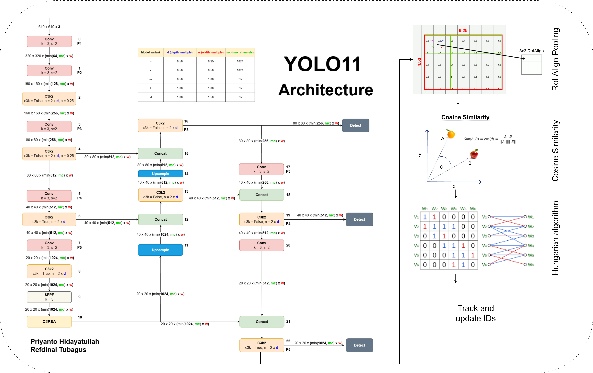
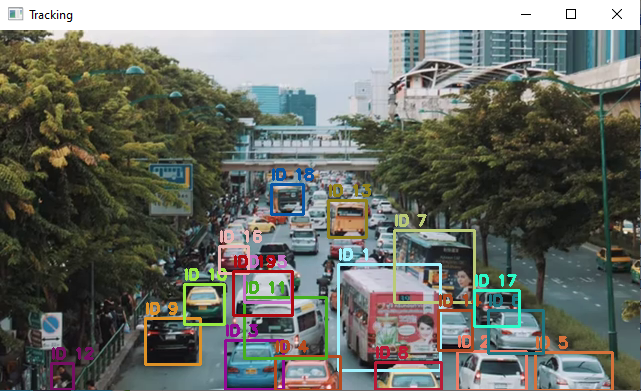

# Object Tracking using YOLO and Feature Matching

I was having fun with **YOLO** and had an idea of using
the YOLO feature maps to do some **similarity analysis** and feature matching between objects in different frames. This is a simple object tracking system that uses YOLO for object detection and **feature matching** for **object tracking** across frames. The system extracts feature embeddings from detected objects and assigns unique IDs to track them.





## Object Tracking Process

The object tracking system consists of three main components: **object detection**, **feature extraction**, and **object tracking**.

#### 1. Object Detection  
- The system uses **YOLO (You Only Look Once)** to detect objects in each video frame.  
- The model predicts bounding boxes and class scores, identifying objects present in the frame.  
- Large bounding boxes that take up most of the frame are ignored to reduce false detections.

#### 2. Feature Extraction  
- After detecting objects, we extract intermediate **feature maps** from a specific layer of the YOLO model.  
- We register a **forward hook** on a deep convolutional layer (e.g., the second-to-last layer) to capture meaningful feature representations.  
- **ROI (Region of Interest) Pooling** is applied to extract features specifically from the detected bounding boxes:  
  - Each detected object’s bounding box is **mapped to the feature map space**.  
  - The **ROI pooling operation** extracts a **fixed-size feature vector** (e.g., 2×2 grid) from the feature map corresponding to the detected region.  
  - This ensures that different-sized objects have **consistent feature representations**, making tracking more reliable.  
- The extracted feature vectors are then **flattened** into a 1D vector for similarity computation.  
- Feature vectors are **normalized** to unit length to improve stability and make similarity comparisons more meaningful.

#### 3. Object Tracking  
- For tracking objects across frames, we use **feature similarity** instead of relying solely on object positions.  
- Steps involved:  
  1. **Cosine Similarity Calculation**:  
     - We compute the **cosine similarity** between the feature vectors of detected objects in the current frame and those from the previous frame.  
     - Higher similarity means a higher likelihood that the object is the same across frames.  
  2. **Assignment with the Hungarian Algorithm**:  
     - Since multiple objects can be detected and need to be assigned correctly across frames, we use the **Hungarian algorithm** to find the optimal object matching.  
     - This ensures minimal overall distance in similarity scores between tracked objects and newly detected objects.  
  3. **Handling Object Loss**:  
     - Objects that disappear from the frame are **tracked for a limited number of frames** (e.g., 100 frames).  
     - If an object is not detected for too long, it is **removed from the tracking list** to prevent ghost tracking.  
  4. **New Object Assignment**:  
     - If a detected object does not match any tracked object, a **new unique ID** is assigned.


## Requirements

### 1. Create and Activate Conda Environment
```sh
conda create -n object_tracking python=3.9 -y
conda activate object_tracking
```

### 2. Install Dependencies
```sh
conda install -c conda-forge opencv numpy scipy
pip install torch torchvision torchaudio ultralytics
```

## Running the Script
To run the object tracking system on a video:
```sh
python main.py
```


## Example Output
After running the script, the system will display a real-time tracking video and save the processed output as a new video file.




